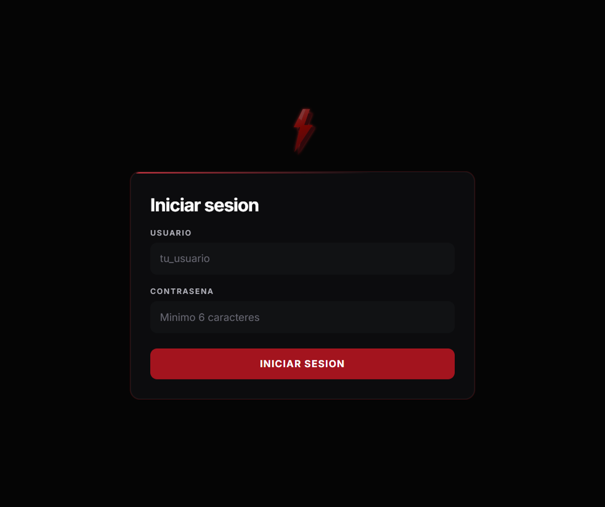

# Login — ATV Audiencia

La pantalla de login de los otros módulos no estaba en este workspace. Esta se armó con la referencia pedida. El rayo es un SVG propio para que el glow siga la forma y no un rectángulo.



## Archivos

- `frontend/src/components/Login.jsx`
- `frontend/src/components/Login.module.css`
- `frontend/src/assets/atv-logo.svg`
- `frontend/src/App.jsx`
- `frontend/src/App.module.css`
- `frontend/src/api.js`
- `backend/src/auth.py`
- `backend/src/controllers/auth_controller.py`
- `backend/src/services/login_services.py`
- `backend/src/schemas.py`
- `backend/main.py`
- `backend/scripts/hash_password.py`
- `backend/requirements.txt`
- `backend/tests/test_logic.py`
- `.env.example`
- `docs/login-atv.png`

Salió la pantalla "Necesitás la sesión del ecosistema". En `frontend/src` no queda "sesión del ecosistema" ni "misma cookie".

## Qué hace

- `POST /api/auth/login` compara usuario y hash bcrypt de `AUDIENCIA_ADMIN_USER` y `AUDIENCIA_ADMIN_PASSWORD_HASH`.
- Si entra, emite solo `audiencia_session`: httpOnly, Secure, SameSite=Lax, 7 días, sin `Domain`. No se emite `ecosystem_session`.
- `require_session` acepta `audiencia_session` o `ecosystem_session`.
- `POST /api/auth/logout` borra `audiencia_session`. El header del dashboard tiene "Cerrar sesión".
- 5 fallos por IP en 15 minutos responden 429.
- Si la API responde 401, el frontend muestra este login.

## Variables en el VPS

En `/opt/atv-audiencia`, después de `git pull`.

Generar el secreto de la cookie propia. Tiene que ser distinto del de los otros módulos y tener al menos 32 caracteres:

```bash
openssl rand -hex 32
```

Elegir el usuario y dejarlo en el `.env` como `AUDIENCIA_ADMIN_USER`. El hash todavía vacío, y `AUDIENCIA_SESSION_SECRET` con el hex de arriba.

Reconstruir para que el contenedor tenga `bcrypt` y el script:

```bash
cd /opt/atv-audiencia && docker compose up -d --build
```

Generar el hash. Pide la contraseña sin mostrarla:

```bash
docker exec -it audiencia-backend python scripts/hash_password.py
```

Pegar esa línea en `AUDIENCIA_ADMIN_PASSWORD_HASH` y recrear el backend para que lea el `.env`:

```bash
cd /opt/atv-audiencia && docker compose up -d --force-recreate backend
```

Sin esas tres variables el contenedor sigue levantando y la cookie del ecosistema sigue sirviendo. El login propio responde 503 hasta que estén las tres.

No commitear el `.env`. El repo es público.
